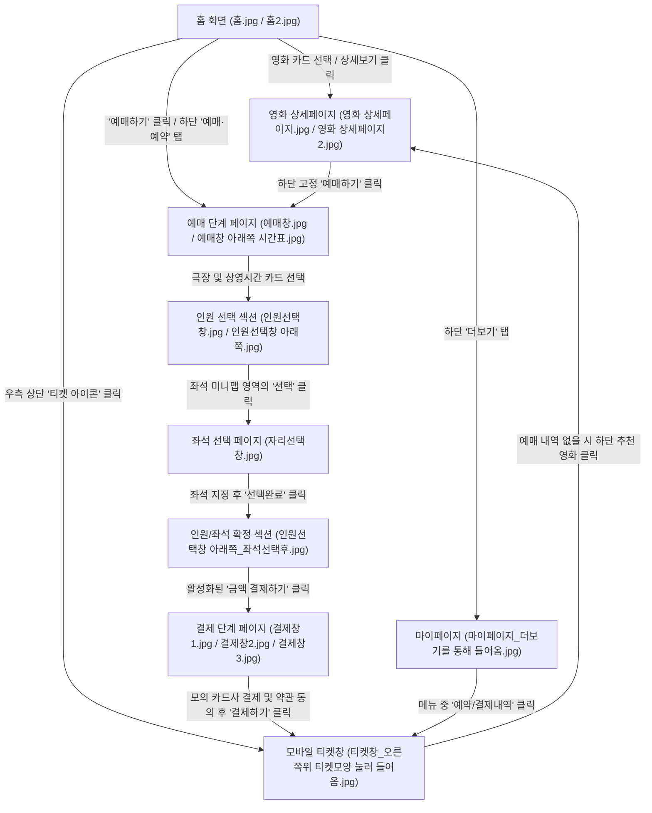

# 영화 예매 서비스(MovieWave) 구현 계획서

제공해주신 15개의 레퍼런스 이미지 분석과 `1차 구현 범위.md` 사양을 기반으로 수립한 프론트엔드 아키텍처 및 구현 계획입니다.

---

## 1. 레퍼런스 이미지 분석 및 페이지 연결 그래프

제공된 15개 이미지의 네이밍과 내용을 분석한 결과, 아래와 같은 엄밀한 페이지 이동 및 사용자 흐름 그래프(Screen Flow Graph)를 도출했습니다.



---

## 2. 1차 MVP 대상 컴포넌트 필터링 (UX 최적화)

레퍼런스의 방대한 커머스/커뮤니티 기능 중 **1차 기획 및 예매 흐름에 필수적인 UI 컴포넌트**만 남겨 미니멀하고 높은 완성도로 구성합니다.

### 2.1 유지/구현 대상 핵심 컴포넌트
* **글로벌 하단 탭바 (Mobile Web App-like Navigation)**:
  * [홈], [예매·예약], [더보기(마이페이지)] 3개 메뉴로 단순화 (레퍼런스의 '씨네톡', '매점' 제외).
* **홈 화면 캐러셀 (Home Poster Slider)**:
  * 1위 '호프', 2위 '스파이더맨' 카드를 좌우 스크롤하며 정보를 볼 수 있는 캐러셀 및 `예매하기`/`상세보기` 액션 버튼.
* **영화 상세 스크린 (Detail Screen)**:
  * 트레일러 동영상 영역, 주요 평표 정보 서클 칩, 하단 고정 예매하기 버튼.
* **통합 예매 및 좌석 선택 여정 (Booking Flow Component)**:
  * **시간표 선택**: 영화/날짜/시간대를 필터링하고 상영관(2D, IMAX) 및 잔여석 카드를 나열하는 3열 그리드.
  * **인원 및 좌석 통합**: 레퍼런스는 화면 전환이 잦아 모바일 웹에서 이탈이 잦을 수 있으므로, 인원 선택과 미니 좌석 배치도를 매끄러운 드롭다운 또는 한 페이지 흐름으로 통합.
  * **전체 좌석 맵 (Seat Map Zoom)**: 좌석 등급(일반석, 장애인석) 및 이미 예약된 좌석(빗금) 상태를 구분해 선택 가능하게 하는 좌석 그리드 인터랙션 컴포넌트.
* **가상 결제 (Mock Payment Form)**:
  * 상품 요약, 간이 결제수단(앱카드 시뮬레이션), 약관 동의 토글, 그리고 최종 결제 완료 트리거.
* **모바일 티켓 (Mobile Ticket)**:
  * 예매 완료 시 티켓 바코드/QR코드 시뮬레이션 및 예매 영화 정보 요약.

### 2.2 배제 대상 컴포넌트 (MVP 범위 외)
* CGV 이벤트/혜택 탭, 미니언즈 탐구생활 등 광고 및 기획 상품 카드.
* 매점 구매 흐름 및 기프트샵 기능.
* CGV 기간권, CJ ONE 기프트카드 등 복잡한 포인트 제휴 시스템 (로컬 스토리지 가상 포인트 차감으로 대체).
* 주차 차량 등록 조회 등 외부 API 의존적인 부가 기능.

---

## 3. 디자인 스타일 가이드 & 외부 폰트 요청

> [!IMPORTANT]
> 레퍼런스 스크린샷과 같이 전반적으로 깔끔한 **화이트 및 라이트 그레이 테마(Light Theme)**를 기본 적용합니다. 단, 영화관 스크린이나 좌석 선택 배치도 등 극장 환경 묘사가 필요한 영역(예: 미니 좌석 배치 카드 내부)에만 부분적으로 어두운 차콜 블랙 배경을 적용하여 시각적 몰입감을 확보합니다.

### 3.1 브랜드 컬러 팔레트 (Branding Colors)
* **Background**: 기본적으로 깨끗한 **화이트(#FFFFFF)** 및 부드러운 연한 그레이(#F3F4F6) 바탕의 라이트 테마(Light Theme). (상영관 스크린 및 좌석 배치 영역 등 특정 블록 컴포넌트 내부에만 어두운 차콜 블랙 `#171717` 배경 혼용)
* **Primary (Point)**: CGV 시그니처 레드 `#E71A0F` 및 강렬한 선홍색 `#FF2E2E`. (예매하기 및 결제 버튼 등에 핵심 강조색으로 적용)
* **Selection State**: 활성화된 선택 테두리는 레퍼런스와 같이 밝은 오렌지-레드 톤 사용. (예: 날짜 선택, 인원 선택, 좌석 선택 활성화 시)
* **Secondary**: 장애인석 하늘색 `#38BDF8`, 비활성화/예약완료 회색 `#E5E7EB` (또는 대각선 빗금 패턴).

### 3.2 외부 폰트 연동 (Typography Request)
레퍼런스의 깔끔하고 모던한 UI 텍스트와 가독성 높은 한글 표현을 위해, 한국어 웹 폰트인 **Pretendard** 혹은 **Noto Sans KR**을 가져와 사용해야 합니다.
* **요청 세부사항**: Next.js 내장 Google Fonts 모듈 (`next/font/google`)을 통해 **Noto Sans KR**을 전역에 적용하겠습니다.
* **폰트 로드 구성**: `app/layout.tsx` 파일 내에서 아래와 같이 로컬 서버 측 캐싱 및 렌더링 최적화를 포함하여 설정합니다.
  ```typescript
  import { Noto_Sans_KR } from 'next/font/google';
  
  const notoSansKr = Noto_Sans_KR({
    subsets: ['latin'],
    weight: ['400', '500', '700', '900'],
    variable: '--font-noto-sans-kr',
  });
  ```

---

## 4. 제안된 변경 사항 (Proposed Files)

### [Component Layer]

#### [NEW] [components/Layout.tsx](file:///c:/Users/minke/Documents/외부출강/260710 항공대 출강_클로드/영화서비스(수업)/src/components/Layout.tsx)
공통 GNB 및 앱 스타일 하단 네비게이션 바 레이아웃 제공.

#### [NEW] [components/SeatMap.tsx](file:///c:/Users/minke/Documents/외부출강/260710 항공대 출강_클로드/영화서비스(수업)/src/components/SeatMap.tsx)
좌석 등급 선택 및 클릭 액션, 동적 미니맵을 연동한 줌인 기능 좌석 맵.

### [Page Layer]

#### [NEW] [app/page.tsx](file:///c:/Users/minke/Documents/외부출강/260710 항공대 출강_클로드/영화서비스(수업)/src/app/page.tsx)
영화 포스터 캐러셀 및 탭 이동이 포함된 홈 화면.

#### [NEW] [app/movies/[id]/page.tsx](file:///c:/Users/minke/Documents/외부출강/260710 항공대 출강_클로드/영화서비스(수업)/src/app/movies/[id]/page.tsx)
영화 상세정보, 스틸컷, 트레일러 비디오 플레이어 및 예매 버튼.

#### [NEW] [app/booking/page.tsx](file:///c:/Users/minke/Documents/외부출강/260710 항공대 출강_클로드/영화서비스(수업)/src/app/booking/page.tsx)
날짜/극장/상영 시간 및 영화 통합 예매 화면.

#### [NEW] [app/booking/seats/page.tsx](file:///c:/Users/minke/Documents/외부출강/260710 항공대 출강_클로드/영화서비스(수업)/src/app/booking/seats/page.tsx)
인원 수 지정(일반/청소년) 및 시각적 좌석 배치도 선택 스크린.

#### [NEW] [app/booking/payment/page.tsx](file:///c:/Users/minke/Documents/외부출강/260710 항공대 출강_클로드/영화서비스(수업)/src/app/booking/payment/page.tsx)
할인 수단, 가상 결제 방법(앱카드), 약관 동의 체크가 포함된 결제 스크린.

#### [NEW] [app/mypage/page.tsx](file:///c:/Users/minke/Documents/외부출강/260710 항공대 출강_클로드/영화서비스(수업)/src/app/mypage/page.tsx)
가상 사용자 등급 바 및 예약 내역 조회 메뉴.

#### [NEW] [app/ticket/page.tsx](file:///c:/Users/minke/Documents/외부출강/260710 항공대 출강_클로드/영화서비스(수업)/src/app/ticket/page.tsx)
발급 완료된 모바일 티켓(바코드, 좌석 번호, 영화 정보) 목록.

---

## 5. 검증 계획 (Verification Plan)

### 수동 검증 항목
1. **반응형 테스트**: Chrome DevTools를 활용하여 iPhone SE(좁은 화면), iPhone 14 Pro Max(일반 모바일), iPad 및 Desktop에서 레이아웃이 깨지지 않고 자연스러운 모바일 앱 경험을 주는지 검사.
2. **예매 상태 동기화**: 특정 영화 시간표의 좌석(예: L6, L7)을 예매 완료한 후, 재예매 시도 시 해당 좌석이 이미 예매 완료(disabled) 상태로 올바르게 표시되는지 확인.
3. **로컬스토리지 무결성**: 마이페이지에서 예매 취소 버튼을 눌렀을 때 로컬스토리지 좌석 점유 정보와 예매 내역 정보가 실시간으로 삭제되는지 확인.
