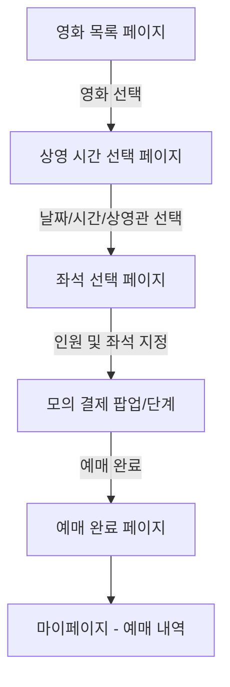

# 영화 예매 서비스 MVP 기획서 (Product Specification)

본 기획서는 **Next.js**, **TypeScript**, **TailwindCSS v4**를 기반으로 구축할 반응형 영화 예매 서비스의 1차 MVP(Minimum Viable Product) 개발 범위를 정의합니다.

---

## 1. 서비스 개요 (Overview)

* **서비스명**: 무비웨이브 (MovieWave)
* **목적**: 모바일 우선(Mobile-First) 반응형 웹 기반의 직관적이고 미려한 영화 예매 경험 제공
* **개발 목표**: 복잡한 실시간 통신 및 실결제 연동을 배제하고, 핵심 예매 여정(영화 선택 → 좌석 선택 → 모의 예매 → 예매 내역 확인)을 완벽하고 부드럽게 구현하여 사용자 경험(UX)과 UI 완성도를 극대화함.

---

## 2. 1차 MVP 개발 범위 (Scope)

> [!IMPORTANT]
> 1차 MVP는 서버 사이드 데이터베이스 및 PG사 결제 연동 없이, **클라이언트 상태 관리(React Context / Zustand)** 및 **로컬 스토리지(LocalStorage)**를 활용하여 가상 비즈니스 로직을 완벽하게 재현합니다.

### 2.1 핵심 사용자 여정


### 2.2 핵심 기능 목록 (Feature Matrix)

| 구분 | 기능명 | 설명 | 비고 |
| :--- | :--- | :--- | :--- |
| **인증** | 가상 간편 로그인 | 이메일 입력만으로 간편 회원가입 및 즉시 로그인 처리 | 로컬 스토리지 세션 유지 |
| **영화** | 영화 목록 & 상세 정보 | 상영 중인 가상의 영화 4~5개 노출, 포스터 및 상세 설명 | 더미 데이터셋 |
| **예매** | 시간표 및 상영관 선택 | 1~2개 가상 극장 지점의 상영관(2D, IMAX 등)별 고정 시간표 선택 | 날짜별 시간 선택 가능 |
| **좌석** | 반응형 좌석 배치도 | 좌석 배치(일반석, 우수석 구분), 실시간 좌석 선택 UI | 남은 좌석수 동적 반영 |
| **결제** | 가상 결제 시뮬레이션 | 포인트 차감 또는 모의 신용카드 결제 완료 UI 처리 | 실결제 없음 |
| **마이페이지**| 예매 내역 및 취소 | 사용자가 예매한 내역 조회, 예매 취소 시 좌석 복구 | 로컬 스토리지 기반 |

---

## 3. 화면 설계 및 반응형 UI 레이아웃

### 3.1 공통 레이아웃 (Navigation & Footer)
* **Desktop**: 좌측/상단 글로벌 네비게이션 바(GNB), 프로필 영역, 미려한 다크 모드 테마.
* **Mobile (Mobile-First)**: 하단 플로팅 네비게이션 바(영화, 예매, 마이페이지) 형태의 앱과 유사한 레이아웃 제공.

### 3.2 주요 화면 상세

#### ① 영화 목록 & 상세 페이지 (`/` & `/movies/[id]`)
* 영화 포스터, 평점, 예매율이 포함된 카드 리스트(Grid Layout).
* 마우스 호버 시 카드 스케일 업 및 디테일 오버레이 노출.
* 상세 페이지에는 유튜브 트레일러(Iframe embed) 및 줄거리, 감독/출연진 정보 포함.

#### ② 예매 단계 페이지 (`/booking`)
* **Step 1. 영화/날짜 선택**: 영화 목록 슬라이더와 날짜 탭을 배치하여 빠르게 선택.
* **Step 2. 극장 및 시간 선택**: 가상 극장("무비웨이브 서울본점")의 상영관 타입(2D, IMAX) 및 상영 시간표 나열.

#### ③ 좌석 선택 페이지 (`/booking/seats`)
* Screen 영역(원형 그라데이션)을 시각화하여 영화관 느낌 극대화.
* 일반석(Standard)과 우수석(Premium)을 색상으로 구분하고 가격 표시.
* 선택한 인원수(성인/청소년)와 선택한 좌석 수 일치 여부 실시간 검증.

#### ④ 결제 및 예매 완료 페이지 (`/booking/confirm` & `/booking/complete`)
* 선택한 좌석 정보, 최종 결제 금액 요약.
* '결제하기' 버튼 클릭 시 마이크로 인터랙션(로딩 애니메이션) 후 완료 페이지로 이동.

#### ⑤ 마이페이지 및 가상 로그인 (`/mypage` & `/login`)
* 마이페이지: 현재 예매 완료된 티켓(바코드 또는 QR 코드 모의 디자인 적용) 및 과거 내역 노출. '예매 취소' 기능 포함.
* 로그인: 비밀번호 없이 이메일 주소만 입력하면 바로 로컬 세션에 저장되고 마이페이지로 이동.

---

## 4. 데이터 모델 설계 (LocalStorage Schema)

로컬 스토리지에 유지될 JSON 구조 정의입니다.

### 4.1 로그인 세션 (`movie_user`)
```json
{
  "email": "user@example.com",
  "name": "홍길동",
  "isLoggedIn": true
}
```

### 4.2 예매 내역 (`movie_reservations`)
```json
[
  {
    "id": "res_1718290382",
    "userEmail": "user@example.com",
    "movie": {
      "id": "movie_1",
      "title": "인셉션",
      "poster": "/images/inception.jpg"
    },
    "theater": "무비웨이브 서울본점",
    "screen": "IMAX 3관",
    "date": "2026-07-15",
    "time": "14:30",
    "seats": ["H12", "H13"],
    "totalPrice": 36000,
    "bookedAt": "2026-07-14T11:45:00Z",
    "status": "RESERVED" 
  }
]
```

### 4.3 좌석 선점 상태 (`movie_occupied_seats`)
* 특정 영화 상영 시간별로 이미 판매된 좌석의 목록을 로컬 스토리지에 관리하여, 사용자가 예매 완료한 좌석은 다음 예매 시 비활성화되도록 구현.
```json
{
  "movie_1_2026-07-15_14:30": ["H12", "H13", "A1", "A2"]
}
```

---

## 5. 기술 스택 및 라이브러리

* **Framework**: Next.js 14+ (App Router)
* **Language**: TypeScript
* **Styling**: TailwindCSS v4 (새로운 `@theme` 문법 및 현대적인 CSS 변수 적극 활용)
* **State Management**: React Context API (예매 상태 흐름 제어)
* **Icons**: React Icons 또는 Lucide React (미려하고 미니멀한 아이콘셋)
* **Animations**: Framer Motion (부드러운 스크린 트랜지션 및 컴포넌트 마이크로 인터랙션)

---

## 6. 2차 확장 계획 (Future Phase 2)

1. **실제 데이터베이스 및 서버 API 연동**: PostgreSQL / Prisma ORM 도입 및 Next.js Server Actions를 활용한 영구 데이터 저장.
2. **소셜 로그인**: Auth.js(구글, 카카오) 연동.
3. **결제 모듈 연동**: 포트원(Portone) 등 결제 대행사(PG) 테스트 모드 연동.
4. **실시간 좌석 연동**: WebSockets 또는 Supabase Realtime을 적용하여 동시 좌석 선점 방지 시스템 구현.
