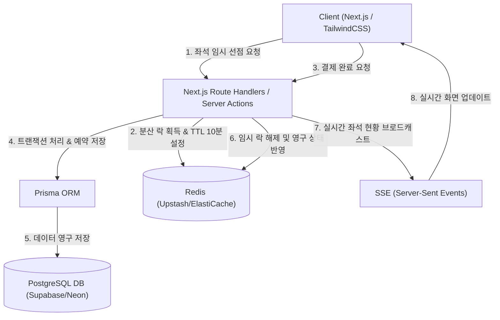
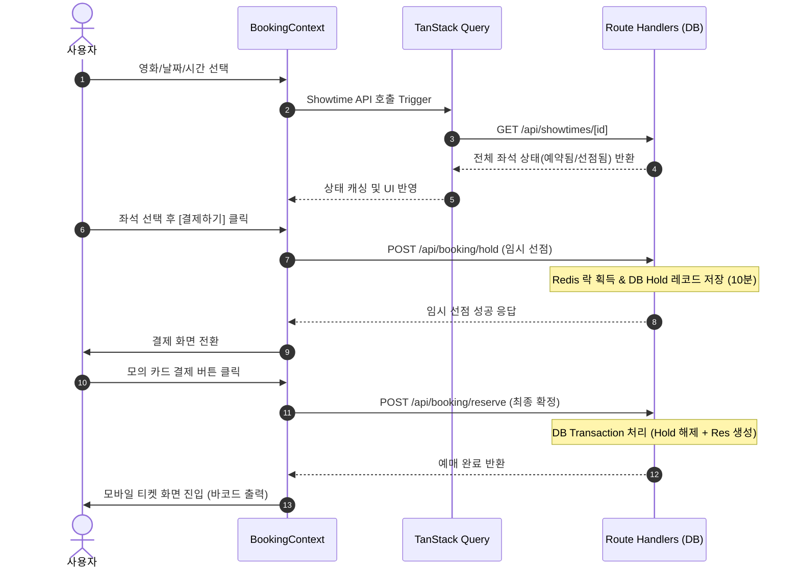

# 영화 예매 서비스 (MovieWave) 백엔드 및 데이터베이스 구현 기획서

현재 로컬 스토리지(LocalStorage) 및 React Context 기반으로 동작하는 영화 예매 서비스를 안정적이고 확장 가능한 실제 프로덕션 수준의 백엔드 및 데이터베이스 아키텍처로 마이그레이션하기 위한 기획서입니다.

---

## 1. 아키텍처 및 기술 스택 제안

현재 Next.js 16 (App Router) 및 React 19, TailwindCSS v4 환경의 강점을 백엔드에서도 극대화하기 위해 다음과 같은 기술 스택을 제안합니다.



### 1.1 핵심 백엔드 기술 스택
* **Web Server & Backend API**: **Next.js App Router (Route Handlers & Server Actions)**
  * 프론트엔드와 백엔드의 언어/도메인 통합 및 신속한 데이터 교환.
  * Server Actions를 활용한 폼 제출 및 뮤테이션의 타입 안정성 확보.
* **Database (RDBMS)**: **PostgreSQL**
  * ACID 트랜잭션 완벽 지원 및 외래 키, 고유 제약 조건을 활용한 데이터 무결성 보장.
  * 향후 복잡한 영화 정보, 스케줄 쿼리를 효율적으로 처리하기 위한 관계형 모델링 적합.
* **ORM (Object-Relational Mapping)**: **Prisma ORM**
  * TypeScript 환경과의 강력한 스키마 결합 및 자동 생성 타입 제공.
  * 마이그레이션 도구(`prisma migrate`)를 통한 쉽고 안전한 DB 스키마 이력 관리.
* **In-Memory Store & Lock**: **Redis**
  * 다중 사용자 동시 좌석 예매 시 발생하는 동시성 충돌을 초고속(In-memory)으로 해제/락킹하기 위한 **분산 락(Distributed Lock)**용도.
  * 10분간 유효한 좌석 임시 선점(Temporary Seat Hold)의 만료시간(TTL) 제어.
* **Realtime Synchronization**: **SSE (Server-Sent Events)**
  * WebSocket에 비해 구현이 단순하고 HTTP 프로토콜 상에서 자연스럽게 동작하며, 서버가 클라이언트로 실시간 좌석 점유율 변동 사항을 단방향 스트리밍하기에 가장 적합.

---

## 2. 데이터베이스 스키마 설계 (Prisma Schema)

로컬 스토리지의 구조화되지 않은 JSON 데이터를 정규화하여 설계한 Prisma DB 스키마입니다.

```prisma
datasource db {
  provider = "postgresql"
  url      = env("DATABASE_URL")
}

generator client {
  provider = "prisma-client-js"
}

/// 1. 사용자 테이블
model User {
  id           String        @id @default(uuid())
  email        String        @unique
  name         String
  passwordHash String // 가상 로그인에서 실제 이메일/비밀번호 인증을 대비한 필드
  createdAt    DateTime      @default(now())
  updatedAt    DateTime      @updatedAt
  reservations Reservation[]
  temporaryHolds TemporaryHold[]
}

/// 2. 영화 테이블
model Movie {
  id            String     @id
  title         String
  poster        String
  ageLimit      String     // "12", "15", "All", "Restricted"
  runtime       String     // "2시간 36분"
  genre         String
  bookingRate   Float      @default(0.0) // 예매율 수치화
  audienceCount Int        @default(0)
  createdAt     DateTime   @default(now())
  showtimes     Showtime[]
}

/// 3. 극장 테이블
model Theater {
  id        String     @id @default(uuid())
  name      String     // "무비웨이브 서울본점"
  location  String
  screens   Screen[]
  showtimes Showtime[]
}

/// 4. 상영관 테이블 (극장 하나에 여러 상영관 존재)
model Screen {
  id         String     @id @default(uuid())
  theaterId  String
  theater    Theater    @relation(fields: [theaterId], references: [id], onDelete: Cascade)
  name       String     // "1관 2D", "3관 IMAX"
  totalSeats Int        // 183
  showtimes  Showtime[]
  seats      Seat[]     // 물리적인 좌석 위치 정의
}

/// 5. 물리 좌석 정보 테이블
model Seat {
  id        String   @id @default(uuid())
  screenId  String
  screen    Screen   @relation(fields: [screenId], references: [id], onDelete: Cascade)
  seatNo    String   // "A1", "A2", "H12" 등
  grade     String   // "STANDARD", "PREMIUM", "DISABLED"
  row       String   // "A", "B", "H"
  col       Int      // 1, 2, 12
  
  @@unique([screenId, seatNo]) // 하나의 상영관 내에서 좌석번호는 유니크
}

/// 6. 상영 스케줄 테이블 (영화, 극장, 상영관, 시간 결합)
model Showtime {
  id         String           @id @default(uuid())
  movieId    String
  movie      Movie            @relation(fields: [movieId], references: [id], onDelete: Restrict)
  theaterId  String
  theater    Theater          @relation(fields: [theaterId], references: [id], onDelete: Restrict)
  screenId   String
  screen     Screen           @relation(fields: [screenId], references: [id], onDelete: Restrict)
  date       String           // "2026-07-15"
  startTime  String           // "10:30"
  endTime    String           // "13:16"
  createdAt  DateTime         @default(now())
  
  reservations   Reservation[]
  temporaryHolds TemporaryHold[]
}

/// 7. 좌석 임시 선점 테이블 (결제 중인 좌석 10분 잠금)
model TemporaryHold {
  id         String   @id @default(uuid())
  showtimeId String
  showtime   Showtime @relation(fields: [showtimeId], references: [id], onDelete: Cascade)
  userId     String
  user       User     @relation(fields: [userId], references: [id], onDelete: Cascade)
  seatNo     String   // 임시 선점할 좌석 번호
  expiresAt  DateTime // 만료 시간 (생성 시점 + 10분)
  createdAt  DateTime @default(now())

  @@unique([showtimeId, seatNo]) // 동시 선점 방지를 위한 유니크 제약
}

/// 8. 예매 내역 테이블
model Reservation {
  id         String            @id @default(uuid())
  userId     String
  user       User              @relation(fields: [userId], references: [id], onDelete: Restrict)
  showtimeId String
  showtime   Showtime          @relation(fields: [showtimeId], references: [id], onDelete: Restrict)
  seats      String[]          // 예약된 좌석 목록 ex) ["H12", "H13"]
  totalPrice Int
  status     ReservationStatus @default(RESERVED)
  bookedAt   DateTime          @default(now())
  updatedAt  DateTime          @updatedAt
  payment    Payment?
}

enum ReservationStatus {
  RESERVED
  CANCELLED
}

/// 9. 결제 정보 테이블
model Payment {
  id            String        @id @default(uuid())
  reservationId String        @unique
  reservation   Reservation   @relation(fields: [reservationId], references: [id], onDelete: Restrict)
  method        PaymentMethod
  amount        Int
  status        PaymentStatus @default(COMPLETED)
  paidAt        DateTime      @default(now())
}

enum PaymentMethod {
  CARD
  POINT
  EASY_PAY
}

enum PaymentStatus {
  COMPLETED
  REFUNDED
  FAILED
}
```

---

## 3. 동시성 제어 및 실시간 예매 설계

인기 영화 개봉 시 수많은 사용자가 **동시에 동일한 좌석(예: 명당 L열 6, 7번)을 예약하려고 결제까지 시도**할 때의 정합성을 보장하기 위한 다각도 제어 전략입니다.

### 3.1 3단계 방어막 아키텍처

```
[클라이언트 좌석 클릭]
       │
       ▼
1단계: Redis 분산 락 (Redlock/SETNX) 
  - 특정 상영회의 좌석 번호 단위로 락을 시도하여 메모리 레벨에서 1차 차단.
  - 성공 시: 데이터베이스에 임시 선점(TemporaryHold, 10분 TTL) 데이터 입력.
       │
       ▼
2단계: 데이터베이스 Unique 제약조건 (Unique Constraint)
  - `TemporaryHold` 테이블에 `[showtimeId, seatNo]` 유니크 제약조건을 설정하여, 동시 트래픽이 Redis를 뚫더라도 DB 인서트 레벨에서 중복 생성을 원천 차단(UniqueConstraintViolation 예외 발생).
       │
       ▼
3단계: 결제 프로세스 트랜잭션 (Serializable / DB Transaction)
  - 최종 예매 완료(`Reservation` 생성) 및 `TemporaryHold` 삭제는 단일 DB 트랜잭션 내에서 격리 수준을 통해 순차 처리.
```

### 3.2 좌석 임시 선점(Temporary Hold) 상세 흐름도
사용자가 좌석을 클릭하고 '결제하기' 페이지에 도달한 후, 결제 완료 혹은 이탈하기까지의 흐름을 통제합니다.

1. **임시 선점 요청 (Client -> API)**:
   * 사용자가 인원과 좌석(예: H12, H13)을 선택하고 다음 단계로 진입하면, API는 Redis 분산 락을 걸고 DB `TemporaryHold`에 레코드를 삽입합니다. (만료시간: 현재시간 + 10분)
2. **락 유지 및 자동 만료**:
   * Redis의 해당 키에 TTL 10분을 부여하고, DB의 `expiresAt`도 10분 후로 설정합니다.
   * 백그라운드 스케줄러(예: 1분 주기로 실행되는 Prisma cron job 또는 Redis keyspace event)가 만료된 `TemporaryHold` 데이터를 지워 다른 사용자가 예매 가능하게 합니다.
3. **결제 완료 시 처리**:
   * 결제가 최종 성공하면 데이터베이스 트랜잭션(Transaction)을 시작합니다.
   * `TemporaryHold` 데이터를 즉시 삭제하고, `Reservation` 및 `Payment` 데이터를 생성합니다.
   * Redis의 임시 락 키를 명시적으로 삭제합니다.

---

## 4. 핵심 API 엔드포인트 설계

Next.js Route Handlers 기반으로 구축할 핵심 API 엔드포인트 목록입니다.

### 4.1 가상 간편 로그인 (`POST /api/auth/login`)
* **설명**: 이메일 주소를 받아 사용자를 조회하거나 없으면 신규 가입 처리한 뒤 JWT 토큰 혹은 세션 쿠키 발급.
* **Request Body**:
  ```json
  { "email": "user@example.com", "name": "홍길동" }
  ```
* **Response (200 OK)**:
  ```json
  {
    "user": { "id": "user-uuid-1234", "email": "user@example.com", "name": "홍길동" },
    "token": "jwt-token-string"
  }
  ```

### 4.2 상영 시간표 및 예매 가능 좌석 조회 (`GET /api/showtimes/[id]`)
* **설명**: 특정 상영 일정의 메타데이터와 **물리 전체 좌석, 임시 선점된 좌석, 이미 예매가 완료된 좌석** 목록을 한 번에 병합하여 반환.
* **Response (200 OK)**:
  ```json
  {
    "showtimeId": "showtime-uuid-abc",
    "movie": { "title": "호프", "runtime": "2시간 36분" },
    "screen": { "name": "5관 2D", "totalSeats": 183 },
    "seats": [
      { "seatNo": "A1", "grade": "STANDARD", "status": "AVAILABLE" },
      { "seatNo": "H12", "grade": "PREMIUM", "status": "OCCUPIED" }, // 예매 완료
      { "seatNo": "H13", "grade": "PREMIUM", "status": "HELD" }      // 임시 선점 중
    ]
  }
  ```

### 4.3 좌석 임시 선점 요청 (`POST /api/booking/hold`)
* **설명**: 사용자가 결제 진입 시 좌석을 10분간 묶어두는 API.
* **Request Body**:
  ```json
  {
    "showtimeId": "showtime-uuid-abc",
    "seats": ["H13"]
  }
  ```
* **Response (200 OK)**:
  ```json
  {
    "success": true,
    "holdIds": ["hold-uuid-xyz"],
    "expiresAt": "2026-07-14T23:35:26Z"
  }
  ```
* **Response (409 Conflict)**:
  ```json
  { "success": false, "message": "선택하신 좌석 중 일부가 이미 선점되었거나 예매 완료되었습니다." }
  ```

### 4.4 결제 및 최종 예매 확정 (`POST /api/booking/reserve`)
* **설명**: 가상 결제 정보를 확인하고 `TemporaryHold`를 해제하며 영구 예약 데이터 생성.
* **Request Body**:
  ```json
  {
    "showtimeId": "showtime-uuid-abc",
    "seats": ["H13"],
    "totalPrice": 18000,
    "payment": { "method": "CARD", "amount": 18000 }
  }
  ```
* **Response (201 Created)**:
  ```json
  {
    "success": true,
    "reservationId": "res-uuid-999",
    "bookedAt": "2026-07-14T23:26:00Z"
  }
  ```

---

## 5. 프론트엔드 마이그레이션 전략 (React Context -> API & Server State)

프론트엔드의 `BookingContext.tsx` 내의 로컬 스토리지 제어 코드를 안전하게 백엔드 통신으로 전환하기 위한 전략입니다.



### 5.1 점진적 마이그레이션 순서
1. **Mock API Handler 구현**:
   * Next.js API Routes에 우선 로컬 스토리지를 활용하는 임시 mock API를 배포하여, 프론트엔드가 HTTP 통신 인터페이스를 먼저 갖추도록 유도합니다.
2. **DB & Prisma 이식**:
   * Prisma 스키마 파일 생성 및 Local DB(PostgreSQL)에 테이블을 마이그레이션합니다.
3. **TanStack Query (React Query) 도입**:
   * `BookingContext.tsx` 내부의 복잡한 로컬스토리지 동기화 및 갱신 로직을 `useQuery`, `useMutation`으로 점진적으로 교체합니다.
   * `refetchInterval`을 활용해 10~30초 단위로 좌석 현황을 주기적으로 동기화하거나 SSE를 통해 실시간 데이터를 수신합니다.
4. **결제 및 취소 로직 서버 이전**:
   * 결제 정보 검증 및 취소에 따른 좌석 원복 처리 비즈니스 로직을 백엔드 트랜잭션 내부로 완전히 이전하여 클라이언트 단의 위변조 가능성을 차단합니다.
